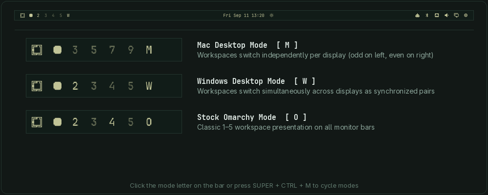

# Workspaces with Desktop Mode (`fred.workspaces`)

Fred's Omarchy workspaces plugin, a shell bar widget for switching workspaces, supporting synchronized dual-monitor desktop pairs, per-monitor independent switching, rich window tooltips, and automatic display geometry detection.



---

## Overview

`fred.workspaces` replaces the stock `omarchy.workspaces` bar widget in-place using Omarchy's `clonedFrom` routing, adding a desktop mode switcher tailored for multi-monitor and single-monitor workflows:

| Mode | Indicator | Description |
| :--- | :---: | :--- |
| **Mac Desktop Mode** | `M` | Workspaces switch independently per display. Odd workspaces (`1, 3, 5, 7, 9`) are pinned to the left monitor; even workspaces (`2, 4, 6, 8, 10`) are pinned to the right monitor. |
| **Windows Desktop Mode** | `W` | Displays switch as synchronized pairs. Desktop `1` activates workspaces `1` (left) and `2` (right); Desktop `2` activates `3` and `4`; Desktop `N` activates `2N-1` and `2N`. |
| **Omarchy Stock Mode** | `O` | Traditional Omarchy presentation showing workspaces `1–5` on both bars. |

---

## Features

- **Quick Mode Toggle**: Click the mode letter (`M` / `W` / `O`) directly on the bar or press `SUPER + CTRL + M` to cycle modes.
- **Rich Window Tooltips**: Hover over any workspace button to view active window titles and applications.
- **Hardware & Geometry Agnostic**: Automatically queries `hyprctl monitors -j` and sorts displays by horizontal coordinate `x` to determine left and right monitors. Single-monitor laptops automatically fallback to standard workspace switching.
- **Optional Monitor Overrides**: Override detected monitors via `~/.config/omarchy/desktop-mode.conf` or environment variables (`OMARCHY_DESKTOP_LEFT_MONITOR`, `OMARCHY_DESKTOP_RIGHT_MONITOR`).
- **Self-Contained Execution**: Bundles the `omarchy-desktop-mode` helper directly in the plugin repository, with automatic fallback resolution between `PATH` and plugin directory.

---

## Installation

Install directly with Omarchy's plugin manager:

```bash
omarchy plugin add https://github.com/greenermoose/omarchy-fred-workspaces.git --enable --yes
```

Because this plugin declares `clonedFrom: "omarchy.workspaces"`, enabling it replaces the stock Omarchy workspace widget in-place in your bar layout.

---

## Hyprland Keybindings

To enable synchronized desktop switching with your keyboard shortcuts, add the following to `~/.config/hypr/bindings.lua` (or reference the bundled script in `hyprland.conf`):

```lua
-- Desktop mode toggle
o.bind("SUPER + CTRL + M", "Toggle Mac/Windows desktop mode", "omarchy-desktop-mode toggle")

-- Switch and move by desktop number
for i = 1, 5 do
  local key = tostring(i)
  o.bind("SUPER + " .. key, "Switch desktop " .. key, "omarchy-desktop-mode switch " .. key)
  o.bind("SUPER + SHIFT + " .. key, "Move window to desktop " .. key, "omarchy-desktop-mode move " .. key)
  o.bind("SUPER + SHIFT + ALT + " .. key, "Move window silently to desktop " .. key, "omarchy-desktop-mode move-silent " .. key)
end
```

> **Note**: If `omarchy-desktop-mode` is not in your `PATH`, you can symlink it into `~/.local/bin/`:
> ```bash
> ln -sf ~/.config/omarchy/plugins/fred.workspaces/omarchy-desktop-mode ~/.local/bin/omarchy-desktop-mode
> ```

---

## CLI Usage

The bundled `omarchy-desktop-mode` command provides scriptable desktop management:

```bash
omarchy-desktop-mode status            # Print current mode (mac, windows, omarchy)
omarchy-desktop-mode indicator         # Print single-letter indicator (M, W, O)
omarchy-desktop-mode toggle            # Cycle mode (omarchy -> mac -> windows)
omarchy-desktop-mode switch <NUMBER>   # Switch to desktop / workspace NUMBER
omarchy-desktop-mode move <NUMBER>     # Move active window to desktop NUMBER and follow
omarchy-desktop-mode move-silent <NUM> # Move active window without switching
omarchy-desktop-mode monitors          # Print detected left/right monitor names
```

---

## Configuration & Overrides

If you wish to explicitly set monitor assignments instead of using automatic geometry detection, create `~/.config/omarchy/desktop-mode.conf` (parsed strictly as a data-only key=value format):

```bash
# Explicit monitor names from `hyprctl monitors` (data-only values, no shell execution)
OMARCHY_DESKTOP_LEFT_MONITOR="DP-2"
OMARCHY_DESKTOP_RIGHT_MONITOR="HDMI-A-1"
```

---

## Uninstallation
 
To remove the plugin and automatically restore the stock Omarchy workspace widget:
 
```bash
omarchy plugin remove fred.workspaces
```

## Acknowledgments

Developed with the assistance of [Antigravity](https://antigravity.google) (Google DeepMind), which contributed to the multi-monitor geometry detection, Mac/Windows desktop switching modes, and plugin architecture.

---

## License

GNU General Public License v3.0 (GPL-3.0-or-later). See [LICENSE](LICENSE) for details.
